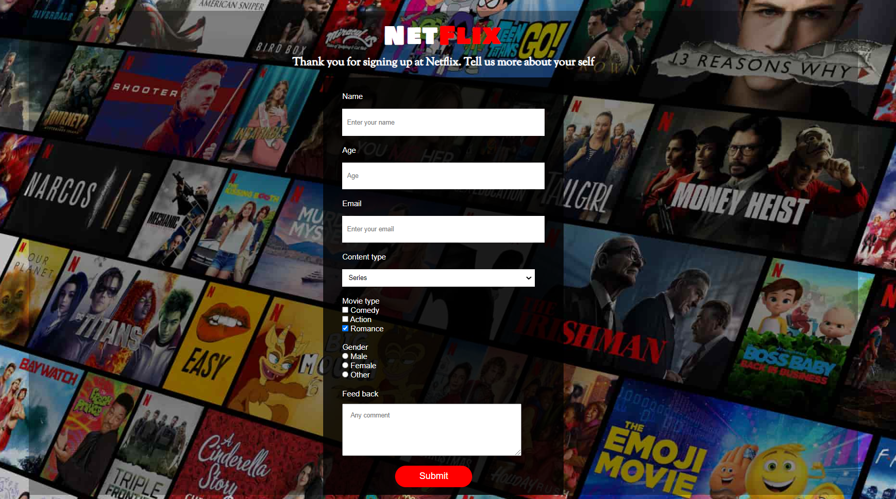

<h1 align="center">📺 Netflix Clone - User Survey</h1>



## 📌 About the Project
This project is a **Netflix-themed User Survey Form**, designed to collect user preferences regarding their favorite content types. The design was initially created in **Figma** and later implemented using **HTML & CSS**.

## 🚀 Features
- **Fully Responsive Design** 📱💻
- **Netflix-Inspired UI** 🎨
- **Built with HTML5 and CSS3** 🏗️
- **Custom Fonts from Google Fonts** ✨
- **Designed in Figma** 🔥

## 🛠️ Technologies Used
- **HTML5** (Structure)
- **CSS3** (Styling)
- **Google Fonts (Bowlby One SC, Sorts Mill Goudy)**
- **Figma** (UI/UX Design)


## 📷 Page Preview
Here is a preview of the project:


## 📂 Installation & Usage
To use this project, follow these steps:

1. Clone the repository:
   ```sh
   git clone https://github.com/Umit8098/Netflix-SurveyForm.git
   ```

2.  Open the index.html file in your browser.

## 🎯 Customization
Text Content: Can be modified in index.html.
Design: Can be customized in style.css.
Images: Can be updated by adding new images to the /image folder.

## 📌 Contributions
Contributions are welcome! Feel free to fork the project and submit a pull request. 🎉

## 📄 License
This project is licensed under the MIT License. You are free to use and modify it.

### 🔥 "Netflix and Chill!" 🔥

